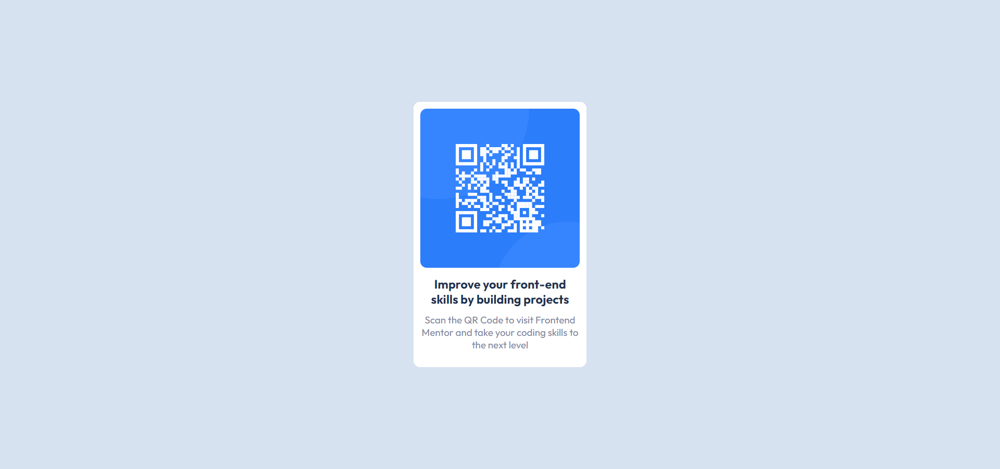

# Frontend Mentor - QR code component solution

This is a solution to the [QR code component challenge on Frontend Mentor](https://www.frontendmentor.io/challenges/qr-code-component-iux_sIO_H).

## Table of contents

- [Overview](#overview)
  - [Screenshot](#screenshot)
  - [Links](#links)
- [My process](#my-process)
  - [Built with](#built-with)
  - [What I learned](#what-i-learned)
  - [Continued development](#continued-development)
- [Author](#author)

**Note: Delete this note and update the table of contents based on what sections you keep.**

## Overview

This is a solution for QR Code Challenge on Frontend Mentor. HTML, CSS and flex-box is used to create the solution.

### Screenshot

Above are screenshots of my solution for desktop and mobile device design.

### Links

- Solution URL: [Add solution URL here](https://github.com/ShashikantBharti/frontendmentor-qr-code-challenge)
- Live Site URL: [Add live site URL here](https://shashikantbharti.github.io/frontendmentor-qr-code-challenge/)

## My process

- First I created a 

 for full width and height of device and gave display: flex and make it's content center;
- Secondaly I create a div with class qr-code and inside it I put qr code image in  tag, heading in <h3></h3> and paragram in 

- Lastly I styled content as required using flex-box.

### Built with

- Semantic HTML5 markup
- CSS custom properties
- Flexbox

### What I learned

I have learned flex box property in css.

### Continued development

I am willing to take more challenges to become a finest frontend designer.

## Author

- Frontend Mentor - [@ShashikantBharti](https://www.frontendmentor.io/profile/ShashikantBharti)
- Github - [@ShashikantBharti](https://www.github.com/ShashikantBharti)
